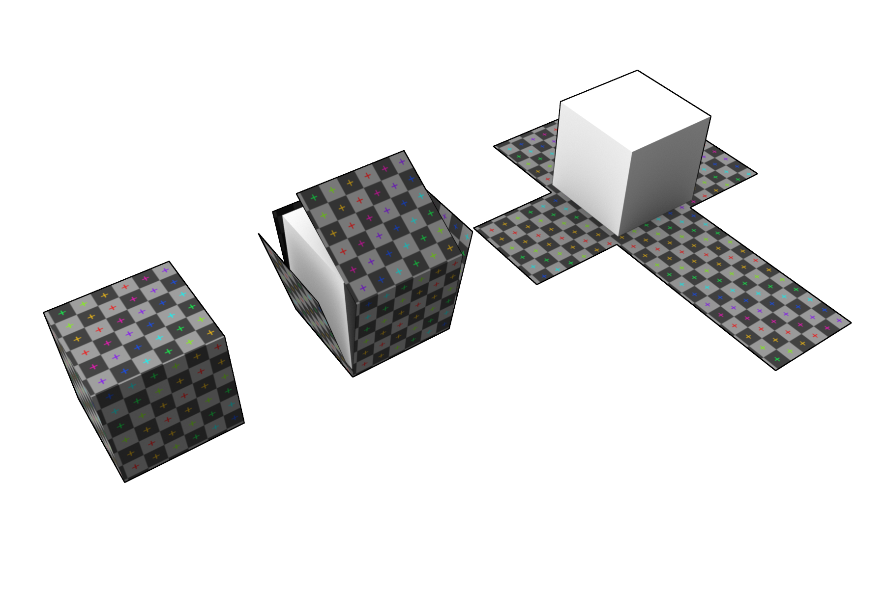
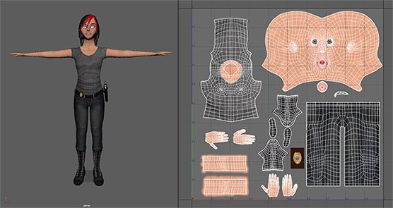
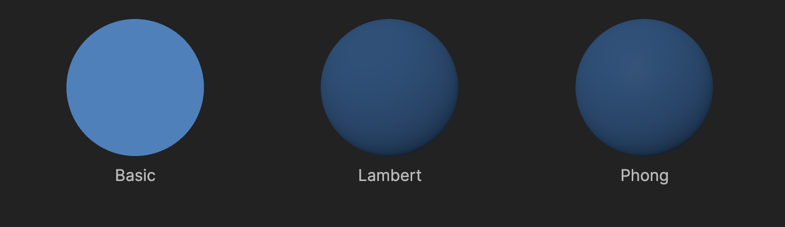

# Prérequis
Récupérez le projet [votre première scène](../premiere-scene/)

# Les matériaux
Les matériaux sont utilisés pour définir l'apparence des objets. Ils peuvent être utilisés pour définir la couleur, la texture, la transparence, la brillance, etc.

Pour plus de détails sur les matériaux, vous pouvez consulter la documentation de Three.js: https://threejs.org/manual/#fr/materials

# Mesh
Un mesh combine une géométrie et un matériau. 

# Texture et UV mapping
- **Texture :** image qui est appliquée sur un objet
```diff
- const material = new THREE.MeshBasicMaterial({ color: 0xFFA500 });
+ const texture = new THREE.TextureLoader().load('wood.jpg');
+ const material = new THREE.MeshBasicMaterial({ map: texture });
```
> - `new THREE.TextureLoader().load('wood.jpg');` permet de charger une texture à partir d'une image
> - `map` permet de définir la texture de l'objet
- **UV mapping :** coordonnées de texture qui sont utilisées pour définir comment une texture est appliquée sur un objet.

Voici des exemples d'UV mapping:
- Cube

- Humain


# Les matériaux
- MeshBasicMaterial
- MeshLambertMaterial
- MeshPhongMaterial



## MeshBasicMaterial
Le `MeshBasicMaterial` est le matériau le plus simple, il ne prend en compte que la couleur et l'opacité. il n'est pas affecté par les lumières. mais il y a des paramètres qui permettent de le rendre plus intéressant. Voici un exemple avec le paramètre `wireframe` qui permet de rendre l'objet en maillage filaire.

```diff
- const material = new THREE.MeshBasicMaterial({ color: 0xFFA500 });
+ const material = new THREE.MeshBasicMaterial({ color: 0xFFA500, wireframe: true });
```
> - `wireframe` permet de définir si l'objet est rendu en maillage filaire ou non
> - `color` permet de définir la couleur de l'objet

## MeshLambertMaterial
Le `MeshLambertMaterial` est un matériau qui prend en compte la couleur, l'opacité et la luminosité.
```diff
- const material = new THREE.MeshBasicMaterial({ color: 0xFFA500 });
+ const material = new THREE.MeshLambertMaterial({ color: 0xFFA500 });
```
> - `color` permet de définir la couleur de l'objet

Maintenant on ne vois plus le cube car il est affecté par la lumière et nous n'avons pas encore ajouté de lumière. Nous allons voir plus en détails les lumières dans le prochain chapitre, mais pour le moment nous allons ajouter une lumière ambiante pour pouvoir voir le cube.
```diff
+ const light = new THREE.AmbientLight(0xFFFFFF, 1);
+ scene.add(light);
```
> - `new THREE.AmbientLight(0xFFFFFF, 1);` permet de créer une nouvelle lumière ambiante avec la couleur blanche et une intensité de 1
> - `scene.add(light);` permet d'ajouter la lumière à la scène

Maintenant on voit le cube mais il est tout blanc, c'est parce que la couleur de la lumière est blanche. Nous allons voir plus en détails les lumières dans le prochain chapitre, mais pour le moment nous allons ajouter une lumière ambiante pour pouvoir voir le cube.

## MeshPhongMaterial
Le `MeshPhongMaterial` est un matériau qui prend en compte la couleur, l'opacité, la luminosité et la brillance.
```diff
- const material = new THREE.MeshLambertMaterial({ color: 0xFFA500 });
+ const material = new THREE.MeshPhongMaterial({color: 0xFFA500, specular: 0xffffff, shininess: 100 });
```
> - `specular` permet de définir la couleur de la brillance
> - `shininess` permet de définir l'intensité de la brillance

Nous allons utiliser un autre type de lumière pour voir la différence avec le `MeshLambertMaterial`. le premier que nous avons utilisé est une lumière ambiante, elle est appliquée uniformément sur tous les objets de la scène. Nous allons utiliser une lumière ponctuelle, elle est appliquée à partir d'un point dans toutes les directions. Nous allons voir plus en détails les lumières dans le prochain chapitre, mais pour le moment nous allons ajouter 3 lumières ponctuelles pour pouvoir voir le cube en brillant.
```diff
+ const light1 = new THREE.PointLight(0xFFFFFF, 100);
+ light1.position.set( 0, 10, 0 );
+ scene.add(light1);
+
+ const light2 = new THREE.PointLight(0xFFFFFF, 100);
+ light2.position.set( 0, -10, 0 );
+ scene.add(light2);
+
+ const light3 = new THREE.PointLight(0xFFFFFF, 100);
+ light3.position.set( 0, 0, 10 );
+ scene.add(light3);
```
> - `new THREE.PointLight(0xFFFFFF, 100);` permet de créer une nouvelle lumière ponctuelle avec la couleur blanche et une intensité de 100
> - `lightX.position.set( x, y, z );` permet de définir la position de la lumière sur les axes x, y et z


# Conclusion
Vous savez maintenant comment créer des matériaux et les appliquer sur des objets. Vous pouvez maintenant passer à la suite pour apprendre à créer des caméras et à les animer.
