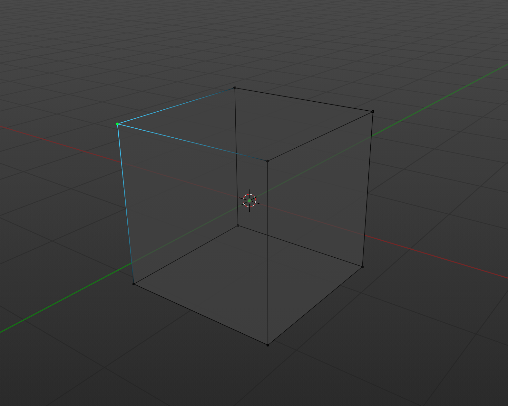
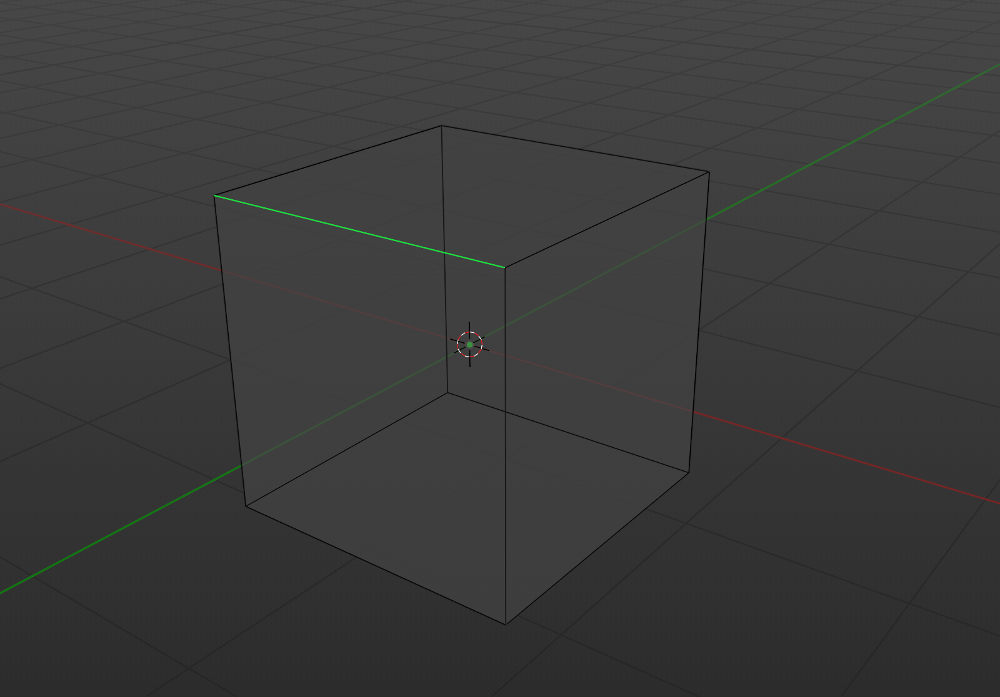
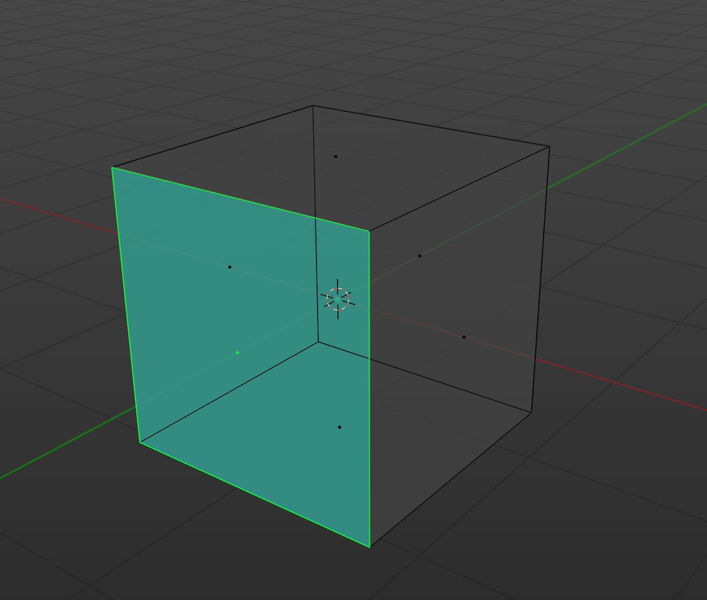

# Prérequis
- Récupérez le projet [votre première scène](../premiere-scene/)

# Les géométries
La géométrie est un objet qui contient les informations sur la forme d'un objet 3D. 

La géométrie est représentée par un ensemble de points, de lignes et de faces:
- `vertices` : liste des points

- `edges` : liste des lignes

- `faces` : liste des faces

# Conclusion
Vous savez maintenant comment créer des géométries et les appliquer sur des objets. Vous pouvez maintenant passer à la suite pour apprendre les matériaux et les textures.

# Références
Il existe plusieurs types de géométries, vous pouvez les trouver dans la documentation de Three.js: https://threejs.org/manual/#fr/primitives
