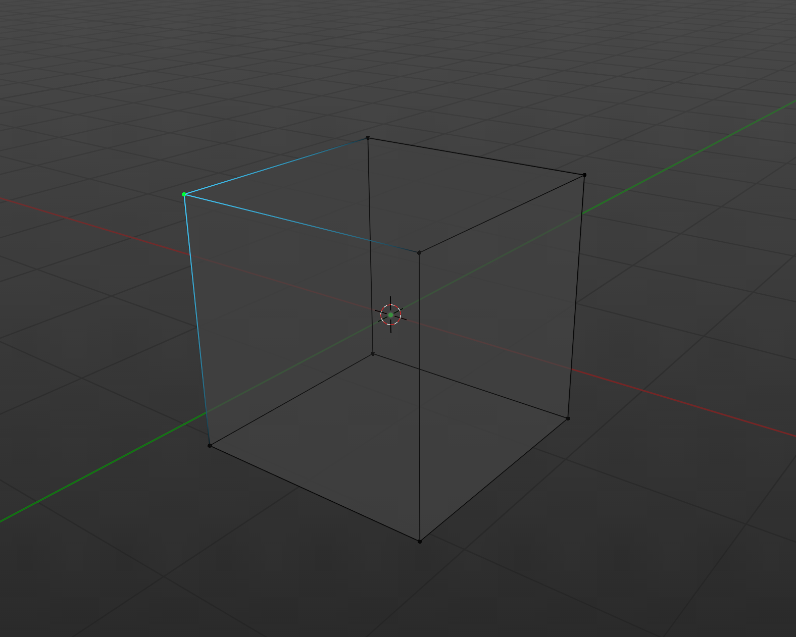
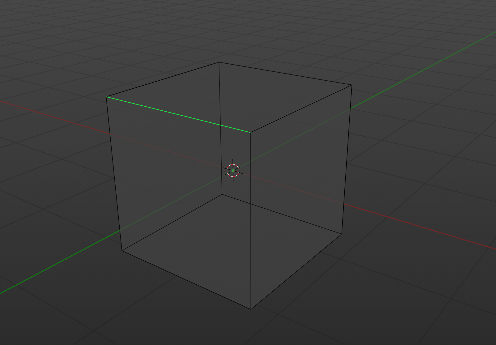
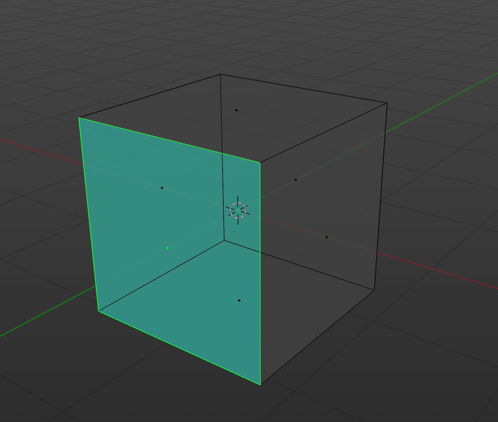

# 3D
La 3D est un domaine de l'informatique qui s'occupe de la représentation d'objets dans un espace à trois dimensions virtuel.

# objets
les objets dans la 3D sont représentés par des formes géométriques, on peut les représenter par des points, des lignes et des faces.
- `vertices` : liste des points

- `edges` : liste des lignes

- `faces` : liste des faces

les objets sont enregistré dans plusieurs extensions, les plus connus sont:
- `.obj`: format de fichier qui contient les informations des objets
- `.fbx`: format de fichier qui contient les informations des objets et des animations
- `.gltf`: format de fichier qui contient les informations des objets et des animations, il est optimisé pour le web

# WebGL
WebGL est une API qui permet de faire du rendu 3D dans un navigateur web. Elle est basée sur OpenGL ES 2.0 et permet d'utiliser le GPU pour faire du rendu 3D pour des performances optimales. le GPU est fort pour faire des calculs en parallèle, il est donc très efficace pour faire du rendu 3D.

# Three.js
Three.js est une bibliothèque JavaScript qui permet de faire du rendu 3D dans un navigateur web en utilisant WebGL. Elle permet de simplifier l'utilisation de WebGL en fournissant des classes et des fonctions pour créer des objets 3D, les animer et les rendre dans un navigateur web.